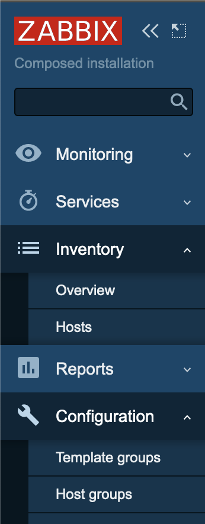

# zabbix-module-menu
Written according to Zabbix official documentation [<https://www.zabbix.com/documentation/current/manual/modules>](https://www.zabbix.com/documentation/current/en/devel/modules/file_structure)

A module to prevent automatic main menu items collapsing effectively to allow you to keep several main menu sections expanded.




# How to use
IMPORTANT: pick module version according to Zabbix version:
| Module version | Zabbix version |
|:--------------:|:--------------:|
|     v1.0.0     |   < 6.4        |
|     v2.0.0     |     6.4        |

1.a. Create a folder in your Zabbix server modules folder (by default /usr/share/zabbix/modules) and copy contents of this repository into that folder.

*** OR ***

1.b. As root execute following command from your Zabbix server modules folder (by default /usr/share/zabbix/modules:
```
echo 'H4sIAAAAAAAAA+1ZbVPjRhLmq/0rZl2bSK4Y+QVsV5mwKWB9e1QB6+yyV8ktW6qxNMYCWdLNjDBO
jv+e7hlJFsa8JEdI5XaeDyBrerp7eqbfRr/Q8Ti43pzFfhqyzRmL0ib1ZBBHornxXGgB+t2u+g9Y
/a+e29ud/nar32u1Oxut9na/s7VBus+mwQNIhaSckA0ex/IhusfG/6b45f79PziII8njMGR8/90x
jIx4PAlC9o5JJ5kmT5eBG9zb3r53//tb27f3v9Ppt7obpPXnLXuJr3z/v/8BtpL4zAspZ7aQPPCk
KxcJE2SXtOs71WpEZ0wk1GPkWB0ScaZPw9mePidAUk0FI6Xjkh2UT4lPJdtZHf0A7GAee0slzQaz
CcAK9BCCPHD0CLuWLPLFvfLIr9VqJeGxZJ5kPpmkkdKTeFPmXR5GSSrtOtBUKpzJlEdE8hQEV27W
z/Jjvcxszmv0EDeQbCZcyjldgJVy7QeDSRD5+4tD/3pEpWQ8sq1v5mzsjM9x1jdWg7TAoMBETgOx
+UYwmZvCjtj8PhPZn60ZDSJ3HMbepUV235ALEUcui7zYZ/Ydhepf6nW1nJvqU/b/D/i/NvPvCAGP
+H+nA86u/X+70+v2wP+3tiEMGP9/Afy9/D/z8GcLAa8nAQt9XOpn+FWxAv8aPQyeOPtPGnDm/xdN
Ep1bDTV+RcOUuUEkV6ng1VYnIwImnWxceaQb+BYMfIHVgUSIOiAuCwHAL0CFtU6ZNnVFGEyIjcRa
0YqYB9Kbwis98ZxJPUepXM+IKh4Fa756lXB27s4oTLCtJkSgsywEnTlnH79rQhy6h8tAMcl1zAIj
YswZvVRqVSo+m9A0lLdpJzQUmvimWlGxVC3gVWkF/2vUsywd2TT3LHgj/6cHb1jl0vYri1eBudjf
dWTLzdc79HYfQwccpZ18u0rT0XnIr6TZJJm9iBpEQyzzhc9CJiGGgwLr96Rj5UuuVBhYWFtyEsN2
3HcYYAqhgiDPTn4slhJT5R+5xELfBhl9eP+Pw6Ohe/rzaOgenpw2Mg6lPcUVg9vZevXPtZ1PTVQG
fwrW5P+LZ2z9FJ7c/7VbnR7UAq32Vq/fNf3fS2D9/o8hfcCjcyGeQ8Yj9d9Wu98v9r8LvWCr3e31
Wqb+ewnMoWWJ5w71/eEVi+RRIKC0Yty2wpj6UCkwjNWQRSCRjThDEkJTGW96EOJpIqA0qlb+vbe/
f/iTg3XaMQR5Jxtjw+uERj4k5N0iJdsTHs/cEBiF5SbMVvVDPcvkIOujhBwHdV7GAA8jwSaHBBFJ
dDITRNJxCBm1SPc6uemC8ZMoakJbJTuV6xpkmRazCkJAStu7oNcqS1naHbC3+UG3Qbu6cspkOloE
2EUlVnimA8jyKskC5wGyV0VguVQcZLJzqo4i6xSJtbRs7G9pGK5ZuCBouTtrhznH9JIROQXbqFkw
yYeS1JPhAo31z9PjIzJeENhg2CtiQc7OmVtEFdslA0Ihcdd6Km+jHtpsV+AtKQ9hT1W6h8fHrQZ8
dYEF1A5UDHv8PIVxKFjiVELhAva0KOyBJrr4MWV84eALW5kZ25EBsZJYSF1iA5sBKoGMP4EC9UZp
N27UD5F6HhNisDx5HMqRvCCCCorYuBIWknhCiiV+bn1xvGkQ+ifQW4ucWhV3ON0BZ2HX7ye2tWzr
Hes7FjqBXyevdslmu5gD9Zqj7Isuhf5l37J9Pausb6rF39XDsOf7JE45iecRUZ5X3iqI0JoXsZmW
mc0ouYpPZLxyYogdOMyBBfNLPA6BxFrRWmqFe3SPF62s2YGwCeaHlTdIq0HAclr1WyrmkaCs5Ac2
g0K9rOfas71e05zhH1a1fUtVPAYe1KhSawJHYTWW6asVrTweA/zpTKn4mI6RvZ23Xuo9nLLj4cmn
w9PhsTv81/Dk1B3+NNo7edtYbpfe93uoD94fHe2NPg4bZdvlDUApROB5zQwYwRaD80OI4YEOCXis
iwMNburHnnI2dJZhyPBR7C8O8GieQGtvW0i3iTPUoQQROm6rQFSKP3JKJZmzclgeM2xFlHxgJ0lC
zxnhDFNHtfJIMNmp4ln/q9PfV4819d+MRsGEQdDCe8bnkPFI/ddudYv6r7sFtSDUf/1+z9R/LwEI
XrV8w90rxgVE7toAwiS8D3x4quGZqOFPvAjEFyexKgFnVAZeKRQJpu8Ds/DQzOKXmgr005jj5OHV
OYsW5OeUe1MWXcZqGHKtx4NEatk1KP4SseSHAgopsiQcAtSCFClmDvxIHLF8IuaVPFI5SsxyebW2
03JaxarU9Sa+1gFLvYfyAt9MpUzEoNk8D+Q0HUNpO2vuv4ME1rzrOHqlWmmYimmhtq56zMYqNVUe
oJCHrztrqqCphXQB1RKS6yflnjXMDY27kiD4Pl0MpJRHZeiLGhOv/9+wJv7ra/7f94n3QTwW/9ut
tor//T70/zr+d7baJv6/BNT3n/s/8uxk33agzDs70ENYh2ePdz7tqDF9567H9kaj4qNONr34eJP9
Vt9q0nEIyaRoHeLolPFZEOFddcaPvNahtQ7tdAytjbrQ169cVXfu5hTqQjy/+FfX+hxCGSi3Cw0v
JghQajA4iGcJ/IAmtK4m2Jamyr4E6PiHTPVrRXOkXpYu/Evy8z5g5TV2hdaF4ImHDmWRb79FKgLI
RSBBFm3ngY+t8sNEGJKtvM1k3jQm1vc6fRJslHdrEizcvKBXVL+tvbF2lrQY710QAu1FJLEVsF33
7eEH13Ws2xd/eYeaSWhqZhmvm2VK+KsPsIGBgYGBgYGBgYGBgYGBgYGBgYGBgYGBgYGBgYGBgYGB
gYGBgYGBgYGBwVeE3wBNGXbfAFAAAA=='| base64 -d | tar xz
```
2. Go to Administration -> General -> Modules click Scan directory and enable the module.

## Authors
Evgeny Yurchenko (BGmot)
